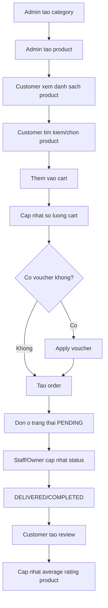

# Tong hop API va Flow he thong

## 1) Tong quan
- Base path: /api
- Tong so endpoint hien co: 45
- Nhom chuc nang: Auth, Users, Categories, Products, Cart, Orders, Reviews, Vouchers

## 2) Danh sach API chi tiet

### Users (/api/users)
| Method | Endpoint | Mo ta |
|---|---|---|
| GET | /api/users | Lay danh sach user |
| GET | /api/users/{id} | Lay user theo id |
| GET | /api/users/role/{role} | Lay user theo role (CUSTOMER, STAFF, OWNER) |
| POST | /api/users | Tao user noi bo (STAFF/OWNER), khong dung cho CUSTOMER register |
| PUT | /api/users/{id} | Cap nhat thong tin user (khong cap nhat password) |
| DELETE | /api/users/{id} | Xoa user |

### Auth (/api/auth)
| Method | Endpoint | Mo ta |
|---|---|---|
| POST | /api/auth/register | Gui OTP xac thuc email cho dang ky |
| POST | /api/auth/verify-email | Xac thuc OTP va tao tai khoan customer |
| POST | /api/auth/login | Dang nhap bang username hoac email |
| POST | /api/auth/forgot-password | Gui OTP reset password qua email |
| POST | /api/auth/reset-password | Xac minh OTP va dat lai mat khau |

### Categories (/api/categories)
| Method | Endpoint | Mo ta |
|---|---|---|
| GET | /api/categories | Lay danh sach category |
| GET | /api/categories/{id} | Lay category theo id |
| POST | /api/categories | Tao category |
| PUT | /api/categories/{id} | Cap nhat category |
| DELETE | /api/categories/{id} | Xoa category |

### Products (/api/products)
| Method | Endpoint | Mo ta |
|---|---|---|
| GET | /api/products | Lay danh sach san pham con kinh doanh |
| GET | /api/products/search?name={name}&brand={brand}&color={color}&faceSize={faceSize}&spec={spec}&status={status}&page={p}&size={s} | Tim kiem san pham theo bo loc (phan trang, `size` la page size) |
| GET | /api/products/{id} | Lay san pham theo id |
| GET | /api/products/{id}/images | Lay danh sach anh cua san pham |
| GET | /api/products/category/{categoryId} | Lay san pham theo category |
| POST | /api/products | Tao san pham |
| POST | /api/products/{id}/images (multipart/form-data) | Upload anh cho san pham |
| PUT | /api/products/{id} | Cap nhat san pham |
| DELETE | /api/products/{id}/images/{imageId} | Xoa anh cua san pham |
| DELETE | /api/products/{id} | Xoa san pham |

### Cart (/api/cart)
| Method | Endpoint | Mo ta |
|---|---|---|
| GET | /api/cart/{customerId} | Lay hoac tao gio hang cua customer |
| POST | /api/cart/{customerId}/items?productId={id}&quantity={q} | Them item vao gio |
| PUT | /api/cart/{customerId}/items/{productId}?quantity={q} | Cap nhat so luong item |
| DELETE | /api/cart/{customerId}/items/{productId} | Xoa item khoi gio |
| DELETE | /api/cart/{customerId}/clear | Xoa toan bo gio |

### Orders (/api/orders)
| Method | Endpoint | Mo ta |
|---|---|---|
| GET | /api/orders/{id} | Lay don hang theo id |
| GET | /api/orders/customer/{customerId}?page={p}&size={s} | Lay lich su don cua customer |
| POST | /api/orders | Tao don hang moi |
| PATCH | /api/orders/{id}/status?status={OrderStatus} | Cap nhat trang thai don (khong nhan CANCELLED) |
| PATCH | /api/orders/{id}/cancel | Huy don |

OrderStatus: PENDING, CONFIRMED, DELIVERED, COMPLETED, CANCELLED, RETURNED

### Reviews (/api/reviews)
| Method | Endpoint | Mo ta |
|---|---|---|
| GET | /api/reviews/product/{productId} | Lay review theo san pham |
| GET | /api/reviews/product/{productId}/average-rating | Lay diem trung binh theo san pham |
| GET | /api/reviews/customer/{customerId} | Lay review theo customer |
| POST | /api/reviews | Tao review |
| PUT | /api/reviews/{id} | Cap nhat review |
| DELETE | /api/reviews/{id} | Xoa review |

### Vouchers (/api/vouchers)
| Method | Endpoint | Mo ta |
|---|---|---|
| GET | /api/vouchers/active | Lay voucher con hieu luc |
| GET | /api/vouchers/{id} | Lay voucher theo id |
| GET | /api/vouchers/code/{code} | Lay voucher theo code |
| POST | /api/vouchers | Tao voucher |
| PUT | /api/vouchers/{id} | Cap nhat voucher |
| POST | /api/vouchers/apply/{code} | Ap dung voucher theo code |
| DELETE | /api/vouchers/{id} | Xoa voucher |

## 3) Flow tong the de mua hang

1. Khach hang dang ky/dang nhap tai khoan
- POST /api/auth/register
- POST /api/auth/verify-email
- POST /api/auth/login

2. Quan tri vien tao danh muc va san pham
- POST /api/categories
- POST /api/products

3. Khach hang duyet san pham
- GET /api/products
- GET /api/products/search
- GET /api/products/{id}

4. Khach hang thao tac gio hang
- GET /api/cart/{customerId}
- POST /api/cart/{customerId}/items
- PUT /api/cart/{customerId}/items/{productId}

5. Khach hang ap ma giam gia (neu co)
- GET /api/vouchers/active
- POST /api/vouchers/apply/{code}

6. Tao don hang
- POST /api/orders

7. Theo doi va xu ly don hang
- GET /api/orders/{id}
- GET /api/orders/customer/{customerId}
- PATCH /api/orders/{id}/status
- PATCH /api/orders/{id}/cancel

8. Sau giao hang, khach danh gia san pham
- POST /api/reviews
- GET /api/reviews/product/{productId}
- GET /api/reviews/product/{productId}/average-rating

## 4) So do Flow (Mermaid)

## 5) Mau loi API

Global exception handler tra ve object gom:
- timestamp
- status
- error
- message
- details (chi co khi can)

HTTP code thuong gap:
- 400: Validation failed
- 404: Runtime exception (duoc map sang not found)
- 409: IllegalStateException
- 500: Loi he thong bat ngo
